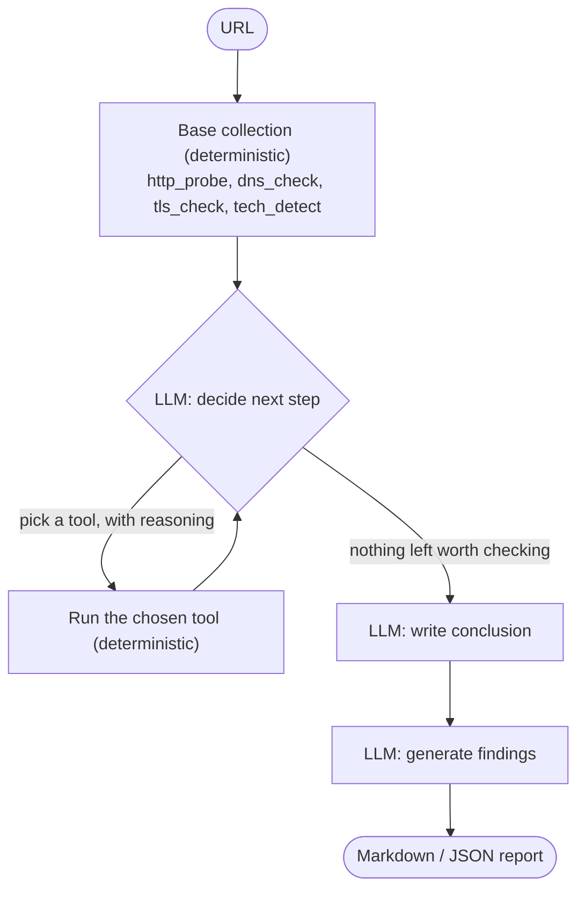

# site-audit-agent

A website often has one real problem worth acting on and nineteen things that
don't matter. A linear scanner reports all twenty with equal weight. This
agent collects data, reads what it found, and decides what to check next
based on that, the same way a person auditing a site would.

**Use this only on sites you own or have written authorization to test.**
Collection is passive (no exploitation, no brute force, no port scanning) and
respects `robots.txt`, but running any scanner against a third party's site
without permission is not something this tool tries to make acceptable for
you.

## Demo

A real run, findings and cost included:

```
$ audit-agent audit https://dujudini.com

# Audit report: https://dujudini.com
Status: complete

## HIGH: Site is fully accessible on two domains with no redirect between them
Both https://dujudini.com and https://www.dujudini.com.br return a 200 OK with
identical content, and neither redirects to the other. The canonical tag on
the .com page points to the .com.br version, but a canonical tag is a hint to
search engines, not a guarantee. Two live, fully-crawlable copies of the same
site can split ranking signals and cause inconsistent indexing.
Recommendation: set up a permanent 301 redirect from .com to .com.br.
Evidence: content_probe, http_probe

## MEDIUM: No DMARC record configured for email domain
...

## LOW: Content-Security-Policy header not set
...

## INFO: TLS certificate is valid and not close to expiring
...

Cost: $0.0411, tokens: 11682 in / 1776 out, iterations: 3, tool calls: 8, 24.1s
```

The HIGH finding above is real. The agent noticed the canonical tag pointed
at a different domain than the one that just answered with 200 OK, and spent
its third iteration confirming that domain actually served the same content
before flagging it. Nobody planted that bug for the demo; that's what an
unrelated maintenance issue looked like on the day this was run.

## Architecture



Every tool (HTTP, DNS, TLS, HTML parsing, PageSpeed) is plain, testable
Python with no model involved. The model does exactly three things: pick the
next tool and justify why, interpret what a tool returned, and write the
`explanation`/`recommendation` prose for a finding. It never invents a number.
If a value appears in a report, it came from a tool call, and `Finding`
validation throws it out otherwise. See `schemas.py` and `findings.py`.

Finding generation is a separate phase from investigation (`agent.py` stops
at a conclusion; `findings.py` turns that into `Finding` objects afterward).
Mixing the two would make it impossible to see which one a bug lives in.

No agent framework. The loop is under 100 lines in `agent.py`, written by
hand so it reads top to bottom. That's the part a framework would have
hidden.

## How the loop decides

Real trace from the run above (`*` marks a decision explicitly conditioned on
a prior result):

1. **it.0** `http_probe`, `dns_check`, `tls_check`, `tech_detect`: fixed base
   collection, always these four, no reasoning needed.
2. **it.1** `headers_audit`, `content_probe`, `perf_probe`: "I'll check the
   areas not yet covered by the base collection, security header details,
   on-page SEO/content structure, and real-world performance, since none of
   these were captured by the initial probes."
3. **it.2 \*** `http_probe` (again, on a different URL): "The canonical tag
   points to a completely different domain (www.dujudini.com.br) while
   dujudini.com serves 200 directly with no redirect. This is a notable
   SEO/duplicate-content issue worth confirming by checking what the
   canonical target actually serves."
4. Conclusion: no further tool calls; findings written up.

That third call is the one the whole project exists to produce: a decision
that only makes sense because of what iteration 1 returned.

## Numbers

Single real run against `dujudini.com` (Sonnet 5, list pricing):

| Metric | Value |
|---|---|
| Cost | $0.0411 |
| Tokens | 11,682 in / 1,776 out |
| Iterations | 3 |
| Tool calls | 8 |
| Duration | 24.1s |

This is one data point, not a statistically rigorous average. Worth running
a batch across real sites before quoting a mean. It's the real number from
the run above, not an estimate.

Evals (`evals/`, 8 fixtures with known planted problems, model responses
recorded once and replayed, no network and no API cost on a normal test run):

- **Recall: 8/8.** Every planted problem was found across all 8 cases.
- **Evidence integrity: 36/36.** Every finding emitted across all 8 cases
  traced to a real collected tool result. Zero were dropped for citing
  fabricated or uncollected data.
- **Healthy-site case:** zero problem-severity findings. The agent emitted
  one `info`-severity summary ("checked, nothing wrong", see `schemas.py`),
  which is the schema's answer to "an agent that always finds something is
  useless," not a false positive.

A simple "findings that match / total findings" precision number is
misleading here and I'm not reporting it. The fixtures are realistic enough
that the model correctly finds several genuine secondary issues beyond the
one problem each case specifically plants, so a naive count penalizes
correct extra findings as if they were noise.

## Guardrails

Every run has a ceiling, configurable via `.env`, safe by default:

| Guardrail | Default |
|---|---|
| Max loop iterations | 12 |
| Max cost per run | $0.50 |
| Max tool calls | 30 |
| Global timeout | 180s |
| Per-tool timeout | 15s |

Hitting any ceiling ends the run with `status: partial` instead of hanging or
throwing. Collection respects `robots.txt`, rate-limits to 1 request/second
per host, and sends an honest, identifiable `User-Agent`. `wordpress_probe`
only exists as an option for the model once `tech_detect` actually confirms
WordPress. An irrelevant tool is never offered.

## Known-CVE cross-referencing (optional)

`vuln_check` matches WordPress core/plugin/theme versions against the
Wordfence Intelligence vulnerability feed, free but requiring an API key.
It's registered alongside `wordpress_probe`, so it only ever appears once
WordPress is confirmed, and it reports `skipped` instead of failing if the
feed file isn't present. Download it once (refresh occasionally, it isn't
auto-updated):

```bash
export WORDFENCE_API_KEY="..."  # wordfence.com > account > Integrations
python scripts/download_wordfence_feed.py
```

## What broke and how I fixed it

- **A Windows console can't print the emoji I used for severity labels.**
  `rich.console.print` crashed with `UnicodeEncodeError` on `cp1252` the
  first time I ran a real report on Windows. Plain text labels (`CRITICAL`,
  `HIGH`, and so on) fixed it and are more CI-log-friendly anyway.
- **PageSpeed's CLS metric got mangled by a generic rounding helper.** CLS is
  a unitless value around 0.0 to 0.3; the same `round(x, 1)` that's fine for
  a millisecond metric collapsed 0.15 to 0.1. A unit test caught it before it
  shipped. `metric()` now takes an explicit precision per field.
- **A repeated tool call broke the evidence schema.** `Evidence.raw` was
  typed as `dict`, correct for a tool called once. The first time the model
  called `dns_check` twice on the same domain, the merged result became a
  list and Pydantic rejected it. Fixed by allowing `dict | list[dict]`. The
  schema needed to model what the loop can actually produce, not just the
  common case.
- **A "certificate expired" finding on a real, unexpired certificate.**
  Auditing `wordpress.org` from this project's dev sandbox produced a
  critical TLS finding that turned out to be a network-interception artifact
  of that environment, not a real problem. Confirmed by fetching the chain
  independently with `openssl s_client` and finding every certificate valid.
  Documented as an environment quirk, not fixed in code (there's nothing to
  fix; a strict TLS client is supposed to reject an interception proxy).
- **Two eval cases failed on first run for the wrong reason.** I assumed a
  category the model didn't produce, and a fixture I wrote had a data field
  (`has_spf: false`) that planted a second real problem I hadn't intended.
  Both failures were my test design being wrong, not the agent. Worth
  checking the model's actual output against the raw data before assuming
  the agent hallucinated.

## Installation and usage

```bash
git clone https://github.com/dujudini/site-audit-agent.git
cd site-audit-agent
python -m venv .venv
source .venv/bin/activate  # .venv\Scripts\activate on Windows
pip install -e ".[dev]"
cp .env.example .env
# put your ANTHROPIC_API_KEY in .env; GOOGLE_PAGESPEED_KEY is optional
```

```bash
# foundation tools only, no LLM, no cost
audit-agent probe https://example.com

# full pipeline: loop + findings + report
audit-agent audit https://example.com --out report.md --json-out report.json
```

```bash
pytest              # unit tests + evals, no network, no API cost
ruff check .
mypy src
```

Recording new eval cassettes (only needed after changing `prompts/report.md`
or a fixture, costs a small amount of real API usage):

```bash
python evals/record_cassettes.py
```

## Known limitations

- `perf_probe` needs a free but quota-limited Google PageSpeed key; without
  one it reports `skipped` instead of failing the run.
- Collection is unauthenticated and passive by design. It won't see an
  issue that only appears behind a login.
- DNS resolution goes through Cloudflare's DoH resolver (`1.1.1.1`) rather
  than raw UDP, because some sandboxed environments block outbound UDP:53.
  This is one public resolver's view, not the requesting host's own.
- `tls_check` does a real TLS handshake and will report a real problem if
  something intercepts the connection (a corporate proxy, some sandboxes).
  See the wordpress.org note above. That's correct client behavior, not
  a false positive to suppress.
- The cost/latency numbers above are one real run, not a statistically
  averaged benchmark across many sites.
- `emit_findings` runs once per audit. If the model's tool-use output ever
  fails schema validation entirely (not just individual findings), the whole
  report generation fails rather than degrading partially.
